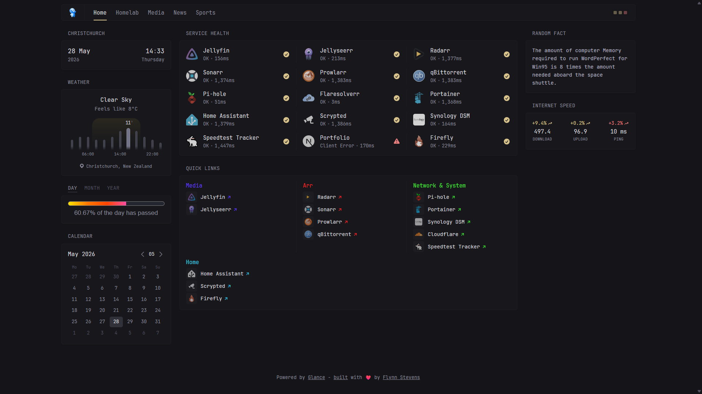

# Glance Dashboard Config

This is my personal Glance dashboard configuration for my homelab. Credit to [ginesjunior11](https://github.com/ginesjunior11) for creating and sharing this setup. I've forked and adapted it to fit my own needs.

## Preview

**Here’s how it looks in my setup:**



## What services am I running?

Everything runs on a **HP Prodesk** with Docker. I also monitor a **Synology NAS**.

| Service                        | Description                                |
| ------------------------------ | ------------------------------------------ |
| **Home Assistant**             | Home automation                            |
| **Jellyfin**                   | Media server                               |
| **Sonarr / Radarr / Prowlarr** | TV/movie management                        |
| **qBittorrent**                | Torrent client                             |
| **Jellyseerr**                 | Media request management                   |
| **PiHole**                     | Network-wide ad blocking                   |
| **Cloudflared**                | Cloudflare tunnel client                   |
| **FlareSolverr**               | Bypassing anti-bot protections             |
| **Tailscale**                  | Remote access                              |
| **Portainer**                  | Docker management                          |
| **Speedtest Tracker**          | Internet speed monitoring                  |
| **Glances**                    | Server resource monitoring                 |
| **Scrypted**                   | Home security camera management            |
| **Synology NAS**               | Monitored via Glances agent                |
| **Firefly III**                | Self hosted personal finance manager       |
| **And more...**                | I’m always adding new services to the mix! |

## Repository structure

```
glance-dashboard-config/
glance/
├── glance.yml         # Main Glance configuration file
├── homelab.yml        # Glance configuration for homelab services
├── media.yml          # Glance configuration for media services
├── news.yml           # Glance configuration for news and social feeds
├── sports.yml         # Glance configuration for sports updates
├── finance.yml        # Glance configuration for financial data
├── .env.example       # Example environment variables file
preview/               # Screenshots and preview images
```

## How to use it

1. **Clone or download** this repository
2. Copy the `.env.example` file and rename it to `.env`:
   ```bash
   cp env.example .env
   ```
3. Edit the `.env` file and fill in your own values (IPs, passwords, API keys)
   - IP addresses
   - API keys
   - tokens
4. Use glance.yml in your setup

5. Enjoy it 😎

---

## Credit

[glance-dashboard-config by ginesjunior11](https://github.com/ginesjunior11/glance-dashboard-config) - Original configuration and inspiration
